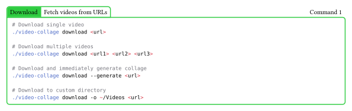
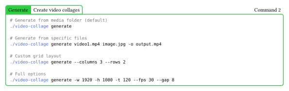
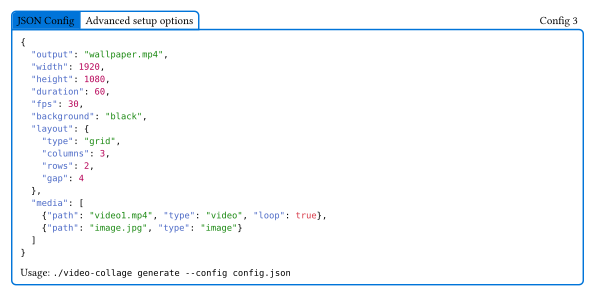
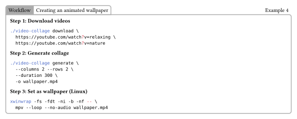

# Video Collage CLI

A terminal-based utility for downloading videos and creating video collages. Perfect for creating animated wallpapers or visual reminders from your favorite content.

## Features

- Download videos from YouTube, Twitter, TikTok, and 1000+ sites
- Combine videos and images into grid layouts
- Auto-looping for seamless playback
- Configurable resolution, duration, and layout
- JSON configuration support for complex setups

## Installation

```bash
# Clone the repository
git clone https://github.com/yourusername/video-collage-cli.git
cd video-collage-cli

# Install Bun (if not already installed)
curl -fsSL https://bun.sh/install | bash

# Install yt-dlp
pip install yt-dlp

# Optional: Install gallery-dl for additional site support
pip install gallery-dl
```

**Requirements:**
- [Bun](https://bun.sh) - JavaScript runtime
- [FFmpeg](https://ffmpeg.org) - Video processing
- [yt-dlp](https://github.com/yt-dlp/yt-dlp) - Video downloading

## Usage

### Download Command

Download videos from URLs and save them to the media folder.

<picture>
  <source media="(prefers-color-scheme: dark)" srcset="assets/frame-dark-1.svg">
  
</picture>

### Generate Command

Create video collages from your downloaded media.

<picture>
  <source media="(prefers-color-scheme: dark)" srcset="assets/frame-dark-2.svg">
  
</picture>

### List Command

View all media files in your collection.

```bash
./video-collage list
```

Output:
```
Media folder: /path/to/video-collage-cli/media

Found 5 file(s):

  1. video1.mp4
  2. video2.mp4
  3. image1.jpg
  4. animation.gif
  5. clip.webm
```

## Configuration

For advanced setups, use a JSON configuration file:

<picture>
  <source media="(prefers-color-scheme: dark)" srcset="assets/frame-dark-3.svg">
  
</picture>

## Workflow Example

<picture>
  <source media="(prefers-color-scheme: dark)" srcset="assets/frame-dark-4.svg">
  
</picture>

## Supported Formats

**Videos:** mp4, mkv, avi, mov, webm, flv, wmv, m4v

**Images:** jpg, jpeg, png, gif, bmp, webp, tiff

## Supported Platforms

yt-dlp supports 1000+ sites including:
- YouTube
- Twitter/X
- TikTok
- Instagram (requires auth)
- Reddit
- Vimeo
- Twitch
- And many more...

## License

MIT

---

**Note:** To regenerate the README frames, run `make readme`. This requires [Typst](https://typst.app).
