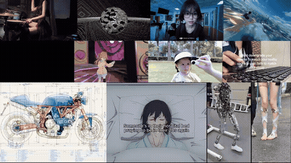

# Video Collage CLI

A terminal-based utility for downloading videos and creating video collages. Perfect for creating animated wallpapers or visual reminders from your favorite content.

<div align="center">

## Demo



*Dynamic layout with 12 videos - generated with `--gpu` hybrid mode*

</div>

## Features

- Download videos from YouTube, Twitter, TikTok, and 1000+ sites
- **5 layout algorithms**: dynamic, grid, masonry, treemap, pack
- **GPU acceleration** with NVIDIA NVENC (hybrid mode)
- Parallel media processing and concurrent downloads
- Auto-looping for seamless playback
- Shader effects (vignette, bloom, CRT, etc.)
- Configurable resolution, duration, and layout

## Installation

```bash
# Clone the repository
git clone https://github.com/divital-coder/video-collage-cli.git
cd video-collage-cli

# Install Bun (if not already installed)
curl -fsSL https://bun.sh/install | bash

# Install yt-dlp
pip install yt-dlp
```

**Requirements:**
- [Bun](https://bun.sh) - JavaScript runtime
- [FFmpeg](https://ffmpeg.org) - Video processing (with NVENC for GPU acceleration)
- [yt-dlp](https://github.com/yt-dlp/yt-dlp) - Video downloading

## Usage

<div align="center">

<picture>
  <source media="(prefers-color-scheme: dark)" srcset="assets/frame-dark-1.svg">
  <source media="(prefers-color-scheme: light)" srcset="assets/frame-1.svg">
  
</picture>

<picture>
  <source media="(prefers-color-scheme: dark)" srcset="assets/frame-dark-2.svg">
  <source media="(prefers-color-scheme: light)" srcset="assets/frame-2.svg">
  
</picture>

</div>

### Layout Algorithms

| Layout | Description | Best For |
|--------|-------------|----------|
| `dynamic` | Row-based packing preserving aspect ratios | Mixed aspect ratios (default) |
| `grid` | Uniform cells in rows/columns | Consistent sizing |
| `masonry` | Pinterest-style vertical columns | Variable heights |
| `treemap` | Space-filling squarified algorithm | Maximum canvas usage |
| `pack` | Bin-packing with shelf algorithm | Mixed sizes |

```
DYNAMIC LAYOUT                          TREEMAP LAYOUT
┌────────┐┌────────┐┌────────┐          ┌──────────────┐┌────────┐
│  16:9  ││  16:9  ││  16:9  │          │              ││ Medium │
└────────┘└────────┘└────────┘          │    Large     │├───┬────┤
┌───────────┐┌───────────┐              │              ││ S │ S  │
│    4:3    ││    4:3    │              ├──────────────┤└───┴────┘
└───────────┘└───────────┘              │    Medium    │
```

## Configuration

<div align="center">

<picture>
  <source media="(prefers-color-scheme: dark)" srcset="assets/frame-dark-3.svg">
  <source media="(prefers-color-scheme: light)" srcset="assets/frame-3.svg">
  
</picture>

</div>

## Workflow

<div align="center">

<picture>
  <source media="(prefers-color-scheme: dark)" srcset="assets/frame-dark-4.svg">
  <source media="(prefers-color-scheme: light)" srcset="assets/frame-4.svg">
  
</picture>

</div>

## GPU Acceleration

The tool supports three processing modes:

| Mode | Flag | Description |
|------|------|-------------|
| CPU | (default) | Software encoding with x264 |
| **Hybrid** | `--gpu` | CPU filters + NVENC encoding (recommended) |
| Experimental | `--gpu-experimental` | Full CUDA pipeline (unreliable) |

**Hybrid mode** is recommended - it uses proven CPU filters for scaling and compositing, while offloading the computationally expensive encoding to NVENC. This provides significant speedup without instability.

```bash
# Check NVENC support
ffmpeg -hide_banner -encoders | grep nvenc
```

### Encoding Presets

| Preset | CPU (x264) | GPU (NVENC) | Use Case |
|--------|------------|-------------|----------|
| `ultrafast` | ultrafast, CRF 28 | p1, CQ 30 | Quick previews |
| `fast` | veryfast, CRF 26 | p2, CQ 26 | Fast encoding |
| `balanced` | medium, CRF 23 | p4, CQ 23 | Default |
| `quality` | slow, CRF 20 | p6, CQ 20 | High quality |
| `best` | veryslow, CRF 18 | p7, CQ 18 | Maximum quality |

### Shader Effects

| Shader | Description |
|--------|-------------|
| `vignette` | Darkens frame edges |
| `bloom` | Glow on bright areas |
| `chromatic` | RGB channel separation |
| `noise` | Film grain texture |
| `crt` | CRT monitor + scanlines |
| `dreamy` | Soft ethereal glow |

## Supported Formats

**Videos:** mp4, mkv, avi, mov, webm, flv, wmv, m4v

**Images:** jpg, jpeg, png, gif, bmp, webp, tiff

## Supported Platforms

yt-dlp supports 1000+ sites including YouTube, Twitter/X, TikTok, Instagram, Reddit, Vimeo, Twitch, and many more.

## License

MIT

---

*To regenerate the README frames, run `make readme`. Requires [Typst](https://typst.app).*
